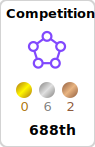
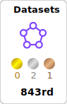
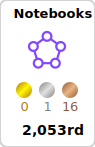
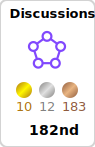

- 👋 Hi, I’m [@Lizhecheng02](https://github.com/Lizhecheng02).
- 👓 My primary interest lies in Natural Language Processing (NLP).
- 💻 An NLP researcher directly mentored by Prof. [Yiwei Wang](https://github.com/wangywUST) and other esteemed professors & a Kaggler primarily focused on various NLP competitions.
- 🌱 I’m currently pursuing a Master’s degree in Computer Science at the University of California, San Diego.
- 📫 Feel free to reach out to me at [zhl186@ucsd.edu](mailto:zhl186@ucsd.edu).

##### My Kaggle

   

   